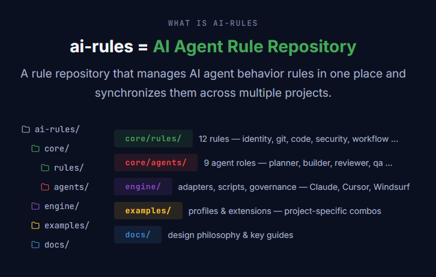

[English](README.md) | [한국어](README.ko.md) · [Changelog](CHANGELOG.md)

# ai-rules

> Policy is what you say. Harness is what you enforce.

<p align="center">
  
</p>

A **structured rules system** for AI coding agents.
Combines text-based rules (advisory) with code-enforced guardrails (deterministic) to create a safe and consistent AI coding environment.

---

## Why ai-rules?

When you tell AI coding agents (Claude Code, Cursor, Copilot, etc.) "don't commit to main" in plain text,
**most of the time they comply. But as context grows longer, they forget.**

```
❌ CLAUDE.md: "Don't commit directly to main"
   → Can be ignored when context exceeds 70%

✅ ai-rules: Text rule + pre-commit hook double-blocks
   → Even if the AI forgets, the hook catches it
```

| Approach | Guarantee Level | Example |
|----------|----------------|---------|
| **Advisory** (text) | AI tries to follow (can be ignored under context pressure) | CLAUDE.md, .cursorrules |
| **Deterministic** (code) | Always enforced (regardless of AI intent) | hooks, git hooks, lint |

ai-rules manages both in **a single system**.

---

## Key Differentiators

### 1. Reversibility-Based Risk Assessment (R0/R1/R2)

Risk is assessed not by pattern matching, but by asking **"Can it be undone?"**

| Level | Condition | Agent Behavior |
|-------|-----------|----------------|
| **R0** — Fully reversible | Local change, instantly reversible | Auto-execute |
| **R1** — Partially reversible | Can be undone, but at significant cost | Requires human approval |
| **R2** — Irreversible | Data loss, external state change | Confirmation phrase re-entry or human-only execution |

```
# Examples that wouldn't be caught by pattern matching, but are classified as R2:
psql -c "DELETE FROM users WHERE 1=1"     # Full data deletion
git push origin HEAD:main                 # Cross-push
curl -X DELETE https://api.prod/...       # External state change
```

> **"Patterns are the quick detector; reversibility is the final judge."**

### 2. 6-Level Agent Autonomy Modes

Other tools only control "allow/block code modifications."
ai-rules separates commit, push, PR, and deploy into **independent axes**.

| Mode | Commit | Push | PR | Deploy | Chat |
|------|--------|------|----|--------|------|
| `manual` | Auto | X | X | X | Normal |
| `auto` | Auto | Auto | Auto | X | Normal |
| `auto-push` | Auto | Auto | Auto | develop | Minimal |
| `staging` | Auto | Auto | Auto | staging | Minimal |
| `production` | Auto | Auto | Auto | main | Minimal |
| `idle` | Auto | Auto | Auto | staging | **Disabled** |

`idle` mode: Overnight autonomous execution. Auto-terminates after 3 errors. No questions allowed.

### 3. Human-AI Authority Boundary

> **"Only humans approve exceptions. Agents only request."**

| Risk Level | Confirmation Method |
|------------|-------------------|
| Low (R0~R1) | `CONFIRM {action}-{date}` |
| Medium (R1~R2) | `CONFIRM {action}-{4-digit-random}-{date}` (agent generates random number) |
| High (R2) | Human executes directly, or approval via external channel |

### 4. Multi-Tool Sync

Generates outputs for multiple tools from a single rule source.

```
core/rules/01-git.md  ──┬──→  CLAUDE.md      (Claude Code)
                        ├──→  .cursor/rules/  (Cursor)
                        ├──→  .windsurfrules  (Windsurf)
                        └──→  AI-RULES.md     (Others)
```

---

## 2-Tier Structure: Use Only What You Need

```
ai-rules/
│
├── core/                  ← Tier 1: Rules + Agents (ready to use)
│   ├── rules/             #   12 rule files
│   ├── agents/            #   9 agent role definitions
│   └── README.md
│
├── engine/                ← Tier 2: Multi-project sync tooling
│   ├── adapters/          #   Claude Code, Cursor, Windsurf output converters
│   ├── scripts/           #   sync, validate, onboard
│   ├── governance/        #   Cross-validation engine
│   └── README.md
│
├── examples/              #   Profile, extension, and agent extension examples
└── docs/guide/            #   Design philosophy and key guides
```

---

## Quick Start

### Option A: scaffold CLI (1 minute)

```bash
# 1. Clone ai-rules
git clone https://github.com/gencrewai/ai-rules.git
cd ai-rules

# 2. Scaffold a new project (creates ../my-app next to ai-rules/)
node engine/cli/scaffold.mjs --name my-app

# Or specify a custom directory:
node engine/cli/scaffold.mjs --name my-app --dev-root D:\dev
```

This single command:
- Composes all 12 rules into a single CLAUDE.md
- Copies 9 agent role definitions to `.claude/agents/`
- Generates stack-specific `.env.example` and tool permissions
- Initializes Git + auto-creates develop branch (protects main)
- Sets up AI logs and docs directory structure

Zero external dependencies — uses only Node.js built-in modules. No npm install required.

Available stacks: `react-fastapi-postgres` (default), `next-fastapi-postgres`, `react-express-postgres`, `react-express-mongodb`, `next-none-none`

```bash
# Example with a different stack:
node engine/cli/scaffold.mjs --name my-app --stack next-none-none --no-git
```

### Option B: Claude Code MCP (interactive)

Register ai-rules as an MCP server and use `scaffold_project` directly from Claude Code.

**1. Install MCP dependencies:**

```bash
cd ai-rules
npm install
```

**2. Add to your Claude Code MCP settings** (`.claude/settings.json` or global config):

```json
{
  "mcpServers": {
    "ai-rules": {
      "command": "node",
      "args": ["/absolute/path/to/ai-rules/engine/mcp-server/index.mjs"]
    }
  }
}
```

**3. Use in Claude Code:**

```
"Create a new project called my-app"
→ scaffold_project(name: "my-app", dev_root: "/path/to/projects")
```

### Option C: Copy-paste rules only (5 minutes)

If you want to quickly apply the core rules without any tooling:

```bash
# 1. Copy-paste the 4 essential rules into your project's CLAUDE.md
#    01-git, 02-code, 03-security, 04-workflow

# 2. Copy agent role definitions
cp core/agents/*.md your-project/.claude/agents/
```

→ [core/README.md](core/README.md)

### Option D: sync engine (multi-project)

If you want to deploy the same rules across multiple projects:

```bash
cd ai-rules
npm install
npm run new -- my-project      # Create a profile
npm run sync                   # Generate rules (dry-run)
npm run sync:apply             # Apply to project
```

→ [engine/README.md](engine/README.md)

---

## Core Rules (12)

| File | Description | Key Feature |
|------|-------------|-------------|
| `00-identity` | Persona, communication style, language | Rule priority conflict matrix |
| `01-git` | Branch, commit, push rules | Protected branch double-blocking (text + hook) |
| `02-code` | Code architecture Hard Bans | Stack-specific forbidden patterns (React/FastAPI) |
| `03-security` | Security, reversibility, STRIDE checks | R0/R1/R2 risk levels + Excessive Agency prevention |
| `04-workflow` | Agent modes, Plan Mode | 6-level autonomy + 4 artifact gates |
| `05-responses` | Response format, confidence labels | Required labels: `[Verified]` / `[Inferred]` / `[Unknown]` |
| `06-session` | Session management, HANDOFF pattern | Distrust + re-verify model (inter-agent handoff) |
| `07-db` | DB safety rules, migration | DB name collision prevention + destructive command blocking |
| `08-local-env` | Port/DB collision prevention | Safe local multi-project operation |
| `08-ui-first` | UI mockup-first principle | Verify HTML mockups before implementation |
| `09-hooks-guide` | Advisory vs Deterministic | Criteria for deciding which rules need hook enforcement |
| `10-subagent-patterns` | Subagent usage patterns | Context protection + least-privilege agent teams |

## Agent Roles (9)

| Agent | Role | Allowed Tools | Model |
|-------|------|---------------|-------|
| `planner` | Task planning, INTENT.md | Read, Glob, Grep, WebSearch | Default |
| `builder` | Implementation, testing, commits | All | Default |
| `reviewer` | Code review, security checks | Read, Glob, Grep | Opus (precision) |
| `qa` | Test execution, verification | Read, Glob, Grep, Bash | Default |
| `security` | Security review | Read, Glob, Grep | Opus (precision) |
| `architect` | Design, DESIGN.md | Read, Glob, Grep, WebSearch | Default |
| `designer` | UI/Design | Read, Glob, Grep | Default |
| `orchestrator` | Team coordination, gate management | Read, Glob, Grep | Default |
| `investigator` | Research/Analysis | Read, Glob, Grep | Default |

> Each agent has only the **minimum permissions** required for its role.
> A reviewer never modifies code; a security agent never attempts patches.

---

## Industry Comparison

| Aspect | ai-rules | Typical Approach |
|--------|----------|-----------------|
| Git workflow control | Commit/Push/PR/Deploy as independent axes | Coupled with code modification |
| Risk assessment | Reversibility-based (R0/R1/R2) | Pattern lists or vague guidelines |
| Approval model | Batch-scoped (P0~P3) | Per-action confirmation (causes fatigue) |
| Confirmation friction | 3 tiers (date → random → direct execution) | Single confirmation |
| Overnight autonomous execution | idle mode (auto-terminates after 3 failures) | Disabled or fully blocked |
| Multi-tool | Claude Code + Cursor + Windsurf | Per-tool individual configuration |
| Authority boundary | Only humans approve exceptions, scope+time-limited | Nominal |

---

## Design Philosophy

- [Harness Engineering](docs/guide/HARNESS_ENGINEERING.md) — Why advisory + deterministic
- [AI Risk Tiers](docs/guide/AI_RISK_TIERS.md) — R0/R1/R2 reversibility-based risk classification
- [AI Vibe Coding Guide](docs/guide/AI_VIBE_CODING_GUIDE.md) — AI collaboration unit design
- [Agent Operating Model](docs/guide/AGENT_OPERATING_MODEL.md) — Agent operating model (4 planes)
- [Human Authority Model](docs/guide/HUMAN_AUTHORITY_MODEL.md) — Human-AI authority boundary
- [Agent Autonomy Comparison](docs/guide/AGENT_AUTONOMY_COMPARISON.md) — Industry agent mode comparison

---

## License

MIT — see [LICENSE](LICENSE)
