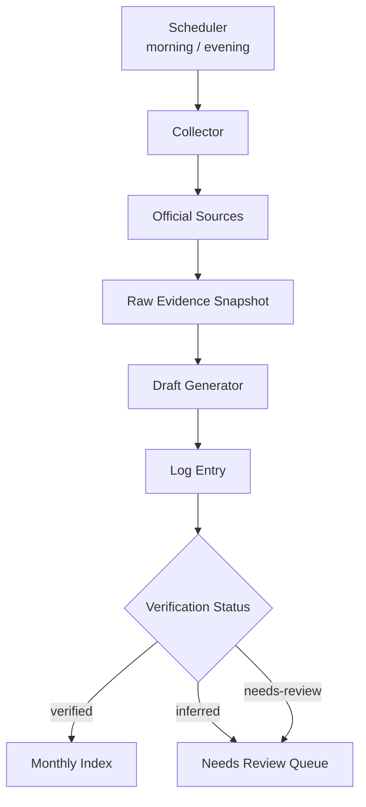
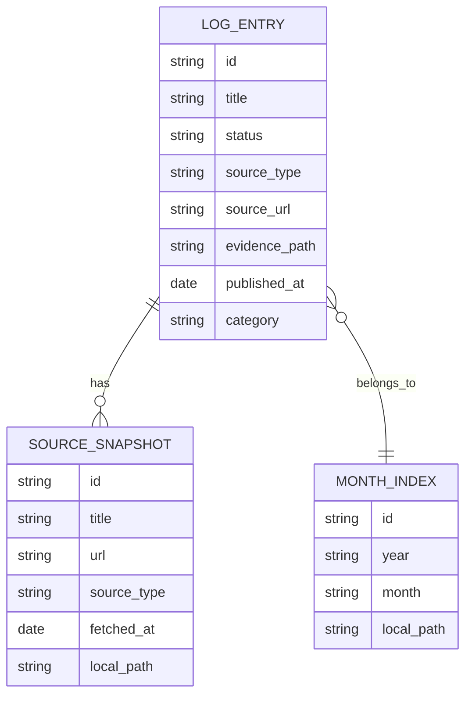

# AI Log Automation Model

> Purpose: A concise overview of the flow, storage structure, and verification architecture needed when designing an AI log system for automated morning/evening updates.

---

## One-Line Summary

Automated updates are safer as `auto-collect -> evidence storage -> draft generation -> review before publishing` rather than `auto-publish`.

---

## Core Flow

---

## Draft ERD

---

## Why This Architecture Works

- Even if there are false positives, you can review the original evidence
- `verified / inferred / needs-review` can be tracked per document
- Monthly pages are easy to auto-update, while in-depth documents can stay in `guide/`
- Logs become auditable records, not just news summaries

---

## Recommended File Paths

- Date documents: `docs/log/YYYY/MM/YYYY-MM-DD-topic.md`
- Source snapshots: `docs/log/YYYY/MM/_sources/topic.md`
- Monthly index: `docs/log/YYYY/MM/00_INDEX.md`
- Yearly index: `docs/log/YYYY/00_INDEX.md`

---

## ai-rules Perspective Notes

- The key to automation is not producing more documents, but accumulating them while maintaining `verifiability`.
- This structure transforms the handbook from a news collection into `evidence-backed operational memory`.
- Later, exposing status badges, source badges, and evidence links in a viewer would help prevent false positives.

---

## Suggested Actions

- Add `verified / inferred / needs-review` badges to the viewer
- Expose `_sources/` documents as collapsible evidence links
- Automate the scheduled workflow only up to draft generation, with a review step before publishing
